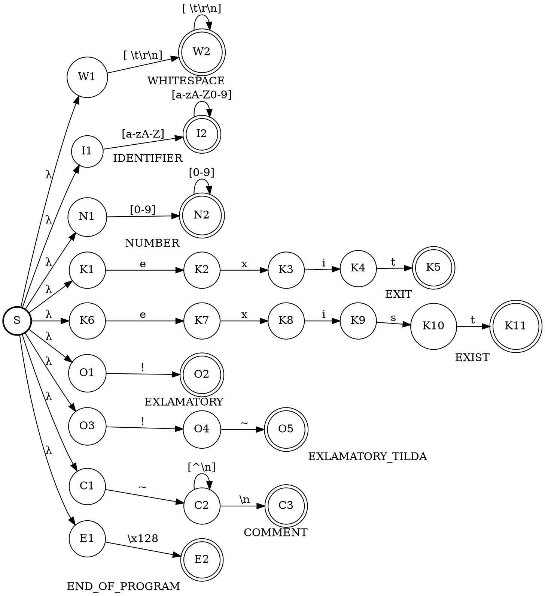
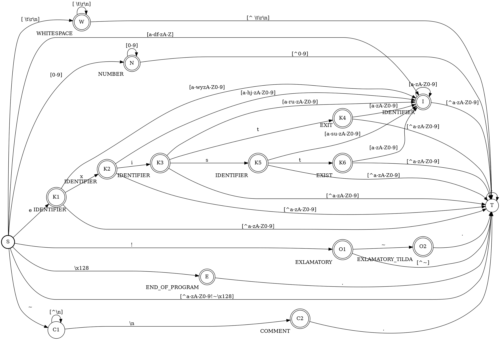

% Лабораторная работа № 1.4 «Лексический распознаватель»
% 20 марта 2024 г.
% Илья Афанасьев, ИУ9-61Б

# Цель работы

Целью данной работы является изучение использования детерминированных конечных
автоматов с размеченными заключительными состояниями (лексических
распознавателей) для решения задачи лексического анализа.

# Индивидуальный вариант

exit, exist, !, !~, комментарии начинаются со знака ~ и продолжаются до конца
строки.

# Реализация

Лексическая структура языка — регулярные выражения для доменов:

* WHITESPACE: [ \\t\\r\\n]
* IDENTIFIER: [a-zA-Z][a-zA-Z0-9]*
* NUMBER: [0-9]+
* EXIT: exit
* EXIST: exist
* EXCLAMATORY: !
* EXCLAMATORY_TILDA: !~
* COMMENT: ~[^\n]

Граф недетерминированного распознавателя:



Граф детерминированного распознавателя:



Реализация распознавателя:

Файл `position.hpp`:

```cpp
#pragma once

#include <memory>

namespace lexer {

class Position final {
 public:
  static constexpr unsigned char kEndCharacter = 128;

  Position() = default;
  Position(std::shared_ptr<const std::string> text) noexcept
      : text_(std::move(text)) {}

  std::size_t get_line() const noexcept { return line_; }
  std::size_t get_pos() const noexcept { return pos_; }
  std::size_t get_index() const noexcept { return index_; }
  const std::shared_ptr<const std::string> get_text() const& noexcept {
    return text_;
  }

  char Cp() const noexcept;
  bool IsEnd() const noexcept;
  bool IsWhitespace() const noexcept;
  bool IsNewLine() const noexcept;
  void Next() noexcept;

  Position operator++(int) noexcept;
  Position operator++() noexcept;

  void Dump(std::ostream& os) const;

 private:
  std::shared_ptr<const std::string> text_ = nullptr;
  std::size_t line_ = 1;
  std::size_t pos_ = 1;
  std::size_t index_ = 0;
};

std::ostream& operator<<(std::ostream& os, const Position& position);

}  // namespace lexer

namespace std {

template <>
struct less<lexer::Position> {
  bool operator()(const lexer::Position& lhs,
                  const lexer::Position& rhs) const noexcept {
    return lhs.get_index() < rhs.get_index();
  }
};

}  // namespace std
```

Файл `position.cpp`:

```cpp
#include "position.hpp"

namespace lexer {

char Position::Cp() const noexcept {
  return (index_ == text_->size() ? kEndCharacter : text_->at(index_));
}

bool Position::IsEnd() const noexcept { return index_ == text_->size(); }

bool Position::IsWhitespace() const noexcept {
  return (index_ != text_->size() && std::isspace(text_->at(index_)));
}

bool Position::IsNewLine() const noexcept {
  if (index_ == text_->size()) {
    return false;
  }

  if (text_->at(index_) == '\r' && index_ + 1 < text_->size()) {
    return (text_->at(index_ + 1) == '\n');
  }

  return (text_->at(index_) == '\n');
}

void Position::Next() noexcept {
  if (index_ == text_->size()) {
    return;
  }

  if (IsNewLine()) {
    if (text_->at(index_) == '\r') {
      ++index_;
    }

    ++line_;
    pos_ = 1;
  } else {
    ++pos_;
  }

  ++index_;
}

Position Position::operator++(int) noexcept {
  auto old = *this;
  Next();
  return old;
}

Position Position::operator++() noexcept {
  Next();
  return *this;
}

void Position::Dump(std::ostream& os) const {
  os << "(" << line_ << ", " << pos_ << ")";
}

std::ostream& operator<<(std::ostream& os, const Position& position) {
  position.Dump(os);
  return os;
}

}  // namespace lexer
```

Файл `fragment.hpp`:

```cpp
#pragma once

#include "position.hpp"

namespace lexer {

class Fragment final {
 public:
  Fragment(const Position& starting, const Position& following) noexcept
      : starting_(starting), following_(following) {}

  const Position& get_starting() const& noexcept { return starting_; }
  const Position& get_following() const& noexcept { return following_; }

  void Dump(std::ostream& os) const;

 private:
  Position starting_;
  Position following_;
};

std::ostream& operator<<(std::ostream& os, const Fragment& fragment);

}  // namespace lexer
```

Файл `fragment.cpp`:

```cpp
#include "fragment.hpp"

namespace lexer {

void Fragment::Dump(std::ostream& os) const {
  os << starting_ << "-" << following_;
}

std::ostream& operator<<(std::ostream& os, const Fragment& fragment) {
  fragment.Dump(os);
  return os;
}

}  // namespace lexer
```

Файл `message.hpp`:

```cpp
#pragma once

#include <string>

#include "position.hpp"

namespace lexer {

const std::string kSyntaxError = "syntax error";

enum class MessageType {
  kError,
  kWarning,
};

std::ostream& operator<<(std::ostream& os, const MessageType type);

class Message final {
 public:
  Message() noexcept : type_(MessageType::kError) {}
  Message(const MessageType type, const std::string& text) noexcept
      : type_(type), text_(text) {}

  MessageType get_type() const noexcept { return type_; }
  const std::string& get_text() const& noexcept { return text_; }

 private:
  MessageType type_;
  std::string text_;
};

}  // namespace lexer
```

Файл `message.cpp`:

```cpp
#include "message.hpp"

namespace lexer {

std::ostream& operator<<(std::ostream& os, const MessageType type) {
  switch (type) {
    case MessageType::kError: {
      os << "Error";
      break;
    }

    case MessageType::kWarning: {
      os << "Warning";
      break;
    }
  }

  return os;
}

}  // namespace lexer
```

Файл `token.hpp`:

```cpp
#pragma once

#include "compiler.hpp"
#include "fragment.hpp"
#include "position.hpp"

namespace lexer {

class Compiler;

enum class DomainTag {
  kComment,
  kEndOfProgram,
  kExclamatory,
  kExclamatoryTilda,
  kExist,
  kExit,
  kIdentifier,
  kNotFinal,
  kNumber,
  kWhitespace,
};

std::ostream& operator<<(std::ostream& os, const DomainTag tag);

class Token {
 public:
  DomainTag get_tag() const noexcept { return tag_; }
  const Fragment& get_coords() const& noexcept { return coords_; }

  virtual ~Token() {}

 protected:
  Token(const DomainTag tag, const Position& starting,
        const Position& following) noexcept
      : tag_(tag), coords_(starting, following) {}

  DomainTag tag_;
  Fragment coords_;
};

class IdentToken final : public Token {
 public:
  IdentToken(const std::size_t code, const Position& starting,
             const Position& following) noexcept
      : Token(DomainTag::kIdentifier, starting, following), code_(code) {}

  std::size_t get_code() const noexcept { return code_; }

 private:
  std::size_t code_;
};

class NumberToken final : public Token {
 public:
  NumberToken(const std::int64_t value, const Position& starting,
              const Position& following) noexcept
      : Token(DomainTag::kNumber, starting, following), value_(value) {}

  std::int64_t get_value() const noexcept { return value_; }

 private:
  std::int64_t value_;
};

class SpecToken final : public Token {
 public:
  SpecToken(const DomainTag tag, const Position& starting,
            const Position& following) noexcept
      : Token(tag, starting, following) {}

  SpecToken(const DomainTag tag, const Position& starting) noexcept
      : Token(tag, starting, starting) {}
};

void OutputToken(std::ostream& os, const Token* const token,
                 const Compiler& compiler);

}  // namespace lexer
```

Файл `token.cpp`:

```cpp
#include "token.hpp"

namespace lexer {

std::ostream& operator<<(std::ostream& os, const DomainTag tag) {
  switch (tag) {
    case DomainTag::kComment: {
      os << "COMMENT";
      break;
    }

    case DomainTag::kEndOfProgram: {
      os << "END_OF_PROGRAM";
      break;
    }

    case DomainTag::kExclamatory: {
      os << "EXLAMATORY";
      break;
    }

    case DomainTag::kExclamatoryTilda: {
      os << "EXLAMATORY_TILDA";
      break;
    }

    case DomainTag::kExist: {
      os << "EXIST";
      break;
    }

    case DomainTag::kExit: {
      os << "EXIT";
      break;
    }

    case DomainTag::kIdentifier: {
      os << "IDENTIFIER";
      break;
    }

    case DomainTag::kNotFinal: {
      os << "NOT_FINAL";
      break;
    }

    case DomainTag::kNumber: {
      os << "NUMBER";
      break;
    }

    case DomainTag::kWhitespace: {
      os << "WHITESPACE";
      break;
    }
  }

  return os;
}

void OutputToken(std::ostream& os, const Token* const token,
                 const Compiler& compiler) {
  os << token->get_coords() << " " << token->get_tag() << " ";

  switch (token->get_tag()) {
    case DomainTag::kNumber: {
      const auto number = static_cast<const NumberToken* const>(token);
      os << number->get_value();
      break;
    }

    case DomainTag::kIdentifier: {
      const auto ident = static_cast<const IdentToken* const>(token);
      os << compiler.GetName(ident->get_code());
      break;
    }
  }
}

}  // namespace lexer
```

Файл `automata.hpp`:

```cpp
#pragma once

#include <array>

#include "position.hpp"
#include "token.hpp"

namespace lexer {

class Automata final {
 public:
  enum State {
    kComment1,
    kComment2,
    kEndOfProgram,
    kIdentifier,
    kKeyword1,
    kKeyword2,
    kKeyword3,
    kKeyword4,
    kKeyword5,
    kKeyword6,
    kNumber,
    kOperation1,
    kOperation2,
    kStart,
    kTrap,
    kWhitespace,
  };

  constexpr Automata() = default;

  State At(const State state, const unsigned char ch) const;

  bool IsFinal(const State state) const;

  DomainTag GetTag(const State state) const;

 private:
  static constexpr std::size_t kStates = 16;
  static constexpr std::size_t kCharacters = 129;
  static constexpr std::size_t kFactors = 13;

  enum Factor {
    kDigit,
    kEndCharacter,
    kExclamatory,
    kLetterE,
    kLetterI,
    kLetterS,
    kLetterT,
    kLetterX,
    kLineFeed,
    kOtherCharacter,
    kOtherLetter,
    kOtherWhitespace,
    kTilda,
  };

  static constexpr std::array<DomainTag, kStates> GetDomainTags() noexcept {
    return {
        DomainTag::kNotFinal,          // State::kComment1
        DomainTag::kComment,           // State::kComment2
        DomainTag::kEndOfProgram,      // State::kEndOfProgram
        DomainTag::kIdentifier,        // State::kIdentifier
        DomainTag::kIdentifier,        // State::kKeyword1
        DomainTag::kIdentifier,        // State::kKeyword2
        DomainTag::kIdentifier,        // State::kKeyword3
        DomainTag::kExit,              // State::kKeyword4
        DomainTag::kIdentifier,        // State::kKeyword5
        DomainTag::kExist,             // State::kKeyword6
        DomainTag::kNumber,            // State::kNumber
        DomainTag::kExclamatory,       // State::kOperation1
        DomainTag::kExclamatoryTilda,  // State::kOperation2
        DomainTag::kNotFinal,          // State::kStart
        DomainTag::kNotFinal,          // State::kTrap
        DomainTag::kWhitespace,        // State::kWhitespace
    };
  }

  static constexpr std::array<Factor, kCharacters> GetFactors() noexcept {
    std::array<Factor, kCharacters> factors;
    factors.fill(Factor::kOtherCharacter);

    for (std::size_t ch = 'a'; ch <= 'z'; ++ch) {
      factors[ch] = Factor::kOtherLetter;
    }

    for (std::size_t ch = 'A'; ch <= 'Z'; ++ch) {
      factors[ch] = Factor::kOtherLetter;
    }

    factors['e'] = Factor::kLetterE;
    factors['i'] = Factor::kLetterI;
    factors['s'] = Factor::kLetterS;
    factors['t'] = Factor::kLetterT;
    factors['x'] = Factor::kLetterX;

    for (std::size_t ch = '0'; ch <= '9'; ++ch) {
      factors[ch] = Factor::kDigit;
    }

    factors['!'] = Factor::kExclamatory;
    factors['~'] = Factor::kTilda;
    factors['\n'] = Factor::kLineFeed;

    for (const auto ch : {' ', '\t', '\r'}) {
      factors[ch] = Factor::kOtherWhitespace;
    }

    factors[Position::kEndCharacter] = Factor::kEndCharacter;

    return factors;
  }

  static constexpr std::array<std::array<State, kFactors>, kStates>
  GetTransitions() noexcept {
    std::array<std::array<State, kFactors>, kStates> table{};

    table[State::kStart] = {
        State::kNumber,        // Factor::kDigit
        State::kEndOfProgram,  // Factor::kEndCharacter
        State::kOperation1,    // Factor::kExclamatory
        State::kKeyword1,      // Factor::kLetterE
        State::kIdentifier,    // Factor::kLetterI
        State::kIdentifier,    // Factor::kLetterS
        State::kIdentifier,    // Factor::kLetterT
        State::kIdentifier,    // Factor::kLetterX
        State::kWhitespace,    // Factor::kLineFeed
        State::kTrap,          // Factor::kOtherCharacter
        State::kIdentifier,    // Factor::kOtherLetter
        State::kWhitespace,    // Factor::kOtherWhitespace
        State::kComment1,      // Factor::kTilda
    };

    table[State::kTrap].fill(State::kTrap);

    table[State::kWhitespace].fill(State::kTrap);
    table[State::kWhitespace][Factor::kLineFeed] = State::kWhitespace;
    table[State::kWhitespace][Factor::kOtherWhitespace] = State::kWhitespace;

    table[State::kIdentifier] = GetIdentifierTransitions();

    table[State::kNumber].fill(State::kTrap);
    table[State::kNumber][Factor::kDigit] = State::kNumber;

    table[State::kKeyword1] = GetIdentifierTransitions();
    table[State::kKeyword1][Factor::kLetterX] = State::kKeyword2;

    table[State::kKeyword2] = GetIdentifierTransitions();
    table[State::kKeyword2][Factor::kLetterI] = State::kKeyword3;

    table[State::kKeyword3] = GetIdentifierTransitions();
    table[State::kKeyword3][Factor::kLetterT] = State::kKeyword4;
    table[State::kKeyword3][Factor::kLetterS] = State::kKeyword5;

    table[State::kKeyword4] = GetIdentifierTransitions();

    table[State::kKeyword5] = GetIdentifierTransitions();
    table[State::kKeyword5][Factor::kLetterT] = State::kKeyword6;

    table[State::kKeyword6] = GetIdentifierTransitions();

    table[State::kOperation1].fill(State::kTrap);
    table[State::kOperation1][Factor::kTilda] = State::kOperation2;

    table[State::kOperation2].fill(State::kTrap);

    table[State::kComment1].fill(State::kComment1);
    table[State::kComment1][Factor::kLineFeed] = State::kComment2;

    table[State::kComment2].fill(State::kTrap);

    return table;
  }

  static constexpr std::array<State, kFactors>
  GetIdentifierTransitions() noexcept {
    return {
        State::kIdentifier,  // Factor::kDigit
        State::kTrap,        // Factor::kEndCharacter
        State::kTrap,        // Factor::kExclamatory
        State::kIdentifier,  // Factor::kLetterE
        State::kIdentifier,  // Factor::kLetterI
        State::kIdentifier,  // Factor::kLetterS
        State::kIdentifier,  // Factor::kLetterT
        State::kIdentifier,  // Factor::kLetterX
        State::kTrap,        // Factor::kLineFeed
        State::kTrap,        // Factor::kOtherCharacter
        State::kIdentifier,  // Factor::kOtherLetter
        State::kTrap,        // Factor::kOtherWhitespace
        State::kTrap,        // Factor::kTilda
    };
  }

  std::array<DomainTag, kStates> domain_tags_ = GetDomainTags();
  std::array<Factor, kCharacters> factors_ = GetFactors();
  std::array<std::array<State, kFactors>, kStates> transitions_ =
      GetTransitions();
};

}  // namespace lexer
```

Файл `automata.cpp`:

```cpp
#include "automata.hpp"

#include <cassert>
#include <iostream>

namespace lexer {

Automata::State Automata::At(const Automata::State state,
                             const unsigned char ch) const {
  assert(0 <= ch && ch < Automata::kCharacters);

  const auto factor = factors_[ch];
  return transitions_[state][factor];
}

bool Automata::IsFinal(const State state) const {
  return (domain_tags_[state] != DomainTag::kNotFinal);
}

DomainTag Automata::GetTag(const State state) const {
  return domain_tags_[state];
}

}  // namespace lexer
```

Файл `compiler.hpp`:

```cpp
#pragma once

#include <map>
#include <unordered_map>
#include <vector>

#include "message.hpp"
#include "scanner.hpp"
#include "token.hpp"

namespace lexer {

class Scanner;

class Compiler final {
 public:
  const std::map<Position, Message>& get_messages() const& noexcept {
    return messages_;
  }

  std::size_t AddName(const std::string& name);
  const std::string& GetName(const std::size_t code) const&;

  void AddMessage(const MessageType type, const Position& p,
                  const std::string& text);
  void OutputMessages(std::ostream& os) const;

 private:
  std::map<Position, Message> messages_;
  std::unordered_map<std::string, std::size_t> name_codes_;
  std::vector<std::string> names_;
};

std::unique_ptr<Scanner> GetScanner(
    const std::shared_ptr<Compiler>& compiler,
    const std::shared_ptr<const std::string>& program) noexcept;

}  // namespace lexer
```

Файл `compiler.cpp`:

```cpp
#include "compiler.hpp"

#include "message.hpp"

namespace lexer {

std::size_t Compiler::AddName(const std::string& name) {
  if (const auto it = name_codes_.find(name); it != name_codes_.cend()) {
    return it->second;
  }

  const auto code = names_.size();
  names_.push_back(name);
  name_codes_[name] = code;
  return code;
}

const std::string& Compiler::GetName(const std::size_t code) const& {
  return names_.at(code);
}

void Compiler::AddMessage(const MessageType type, const Position& p,
                          const std::string& text) {
  messages_[p] = Message(type, text);
}

void Compiler::OutputMessages(std::ostream& os) const {
  os << "MESSAGES:\n";

  for (const auto& [position, message] : messages_) {
    os << '\t' << message.get_type() << " " << position << ": "
       << message.get_text() << '\n';
  }
}

std::unique_ptr<Scanner> GetScanner(
    const std::shared_ptr<Compiler>& compiler,
    const std::shared_ptr<const std::string>& program) noexcept {
  return std::make_unique<Scanner>(program, compiler);
}

}  // namespace lexer
```

Файл `scanner.hpp`:

```cpp
#pragma once

#include <list>
#include <memory>

#include "compiler.hpp"
#include "fragment.hpp"

namespace lexer {

class Compiler;
class Token;

class Scanner final {
 public:
  Scanner(std::shared_ptr<const std::string> program,
          std::shared_ptr<Compiler> compiler) noexcept
      : program_(std::move(program)),
        compiler_(std::move(compiler)),
        cur_(program_) {}

  const std::list<Fragment>& get_comments() const& noexcept {
    return comments_;
  }

  std::unique_ptr<Token> NextToken();

 private:
  std::shared_ptr<const std::string> program_;
  std::shared_ptr<Compiler> compiler_;
  std::list<Fragment> comments_;
  Position cur_;
};

}  // namespace lexer
```

Файл `scanner.cpp`:

```cpp
#include "scanner.hpp"

#include <sstream>

#include "automata.hpp"

namespace lexer {

static constexpr Automata automata{};

std::unique_ptr<Token> Scanner::NextToken() {
  std::ostringstream image;
  Position start;
  Automata::State state, last_final;
  DomainTag tag;

  while (true) {
    if (cur_.IsEnd()) {
      return std::make_unique<SpecToken>(DomainTag::kEndOfProgram, cur_);
    }

    image.str(std::string());
    start = cur_;
    state = Automata::State::kStart;
    last_final = state;

    while (true) {
      state = automata.At(state, cur_.Cp());

      if (state == Automata::State::kTrap) {
        tag = automata.GetTag(last_final);

        if (tag == DomainTag::kWhitespace) {
          break;

        } else if (tag == DomainTag::kNotFinal) {
          compiler_->AddMessage(MessageType::kError, cur_++, kSyntaxError);
          break;

        } else if (tag == DomainTag::kComment) {
          comments_.emplace_back(start, cur_);
          break;

        } else if (tag == DomainTag::kExclamatory ||
                   tag == DomainTag::kExclamatoryTilda ||
                   tag == DomainTag::kExist || tag == DomainTag::kExit) {
          return std::make_unique<SpecToken>(tag, start, cur_);

        } else if (tag == DomainTag::kIdentifier) {
          const auto code = compiler_->AddName(image.str());
          return std::make_unique<IdentToken>(code, start, cur_);

        } else if (tag == DomainTag::kNumber) {
          const auto value = std::stoll(image.str());
          return std::make_unique<NumberToken>(value, start, cur_);
        }
      }

      if (automata.IsFinal(state)) {
        last_final = state;
      }

      image << (cur_++).Cp();
    }
  }
}

}  // namespace lexer
```

# Тестирование

Входные данные

```
12345e ex exi exit exis
  exist existential_crisis !~ a0 a0! ~A comment till the end of line...
 !~Not a comment, but an operation~A new comment!
```

Вывод на `stdout`

```
TOKENS:
	(1, 1)-(1, 6) NUMBER 12345
	(1, 6)-(1, 7) IDENTIFIER e
	(1, 8)-(1, 10) IDENTIFIER ex
	(1, 11)-(1, 14) IDENTIFIER exi
	(1, 15)-(1, 19) EXIT 
	(1, 20)-(1, 24) IDENTIFIER exis
	(2, 3)-(2, 8) EXIST 
	(2, 9)-(2, 20) IDENTIFIER existential
	(2, 21)-(2, 27) IDENTIFIER crisis
	(2, 28)-(2, 30) EXLAMATORY_TILDA 
	(2, 31)-(2, 33) IDENTIFIER a0
	(2, 34)-(2, 36) IDENTIFIER a0
	(2, 36)-(2, 37) EXLAMATORY 
	(3, 2)-(3, 4) EXLAMATORY_TILDA 
	(3, 4)-(3, 7) IDENTIFIER Not
	(3, 8)-(3, 9) IDENTIFIER a
	(3, 10)-(3, 17) IDENTIFIER comment
	(3, 19)-(3, 22) IDENTIFIER but
	(3, 23)-(3, 25) IDENTIFIER an
	(3, 26)-(3, 35) IDENTIFIER operation
	(4, 1)-(4, 1) END_OF_PROGRAM 
COMMENTS:
	(2, 38)-(3, 1)
	(3, 35)-(4, 1)
MESSAGES:
	Error (2, 20): syntax error
	Error (3, 17): syntax error
```

# Вывод

В результате выполнения лабораторной работы я изучил использование
детерминированных конечных автоматов с размеченными заключительными состояниями
для решения задачи лексического анализа. В реализации вся информация об
автомате явно задаётся в программе. С одной стороны, это позволяет задавать
автомат на этапе компиляции программы. Однако в общем случае рациональнее
автоматически генерировать лексический распознаватель (например, утилитой flex,
которая будет использоваться в следующей лабораторной работе).
